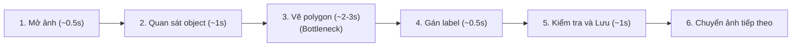
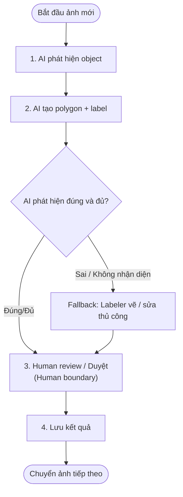
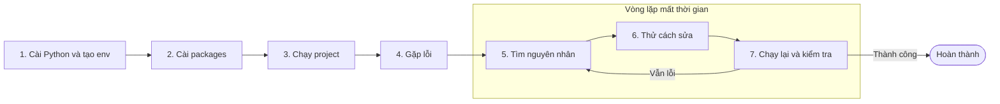
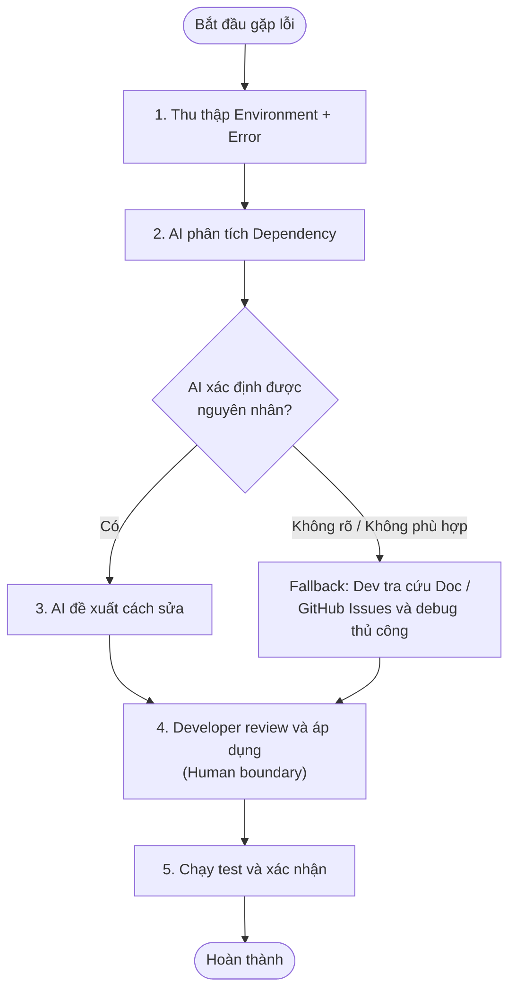
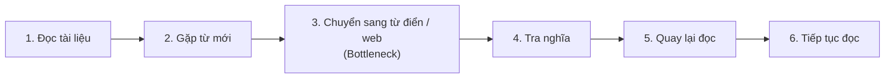
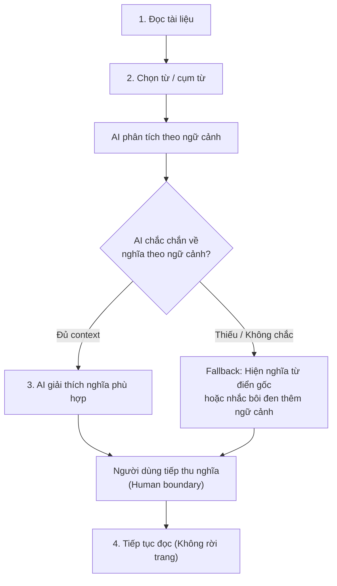

# 01 — Individual Problem Scan

> Điền theo Phase 1 + Phase 2 trong `01-worksheet.md`. Tự scan trước, dùng AI sau để phản biện. Không copy ví dụ Weekly Report.

## Thông tin cá nhân

- Họ và tên: Hà Trung Dũng
- Mã học viên:2A202602948
- Vai trò / bối cảnh (VD: sinh viên năm X, intern PM, ...): sinh viên mới ra trường
- Công việc hằng tuần (3-5 gạch đầu dòng để soi problem):rải CV xin việc ở nhiều công ty khác nhau, tự học về các khóa học AI trên mạng để trau dồi kiến thức, tự làm project cá nhân.

---

## Phase 1 — Scan 5+ problems (tối thiểu 5, khuyến khích 8-10)

**Cách điền:** mỗi dòng = việc gì + ai chịu + đo bằng gì. Cột `Dấu hiệu thật` bắt buộc có số: mất bao lâu (bấm giờ mấy lần), mấy lần/tuần, bao nhiêu người gặp, log/ticket/quote nào.

| # | Lăng kính (Lặp lại / Tốn thời gian / AI có thể tốt hơn / Pain từ người khác) | Problem quan sát được | Ai chịu ảnh hưởng? | Dấu hiệu thật (số + bằng chứng) |
|---|---|---|---|---|
| 1 |Lặp lại + Tốn thời gian + AI có thể tốt hơn|Khi đọc tài liệu tiếng Anh, gặp nhiều từ mới thì phải liên tục chuyển sang từ điển/web để tra từng từ. Việc này làm gián đoạn quá trình đọc, dù mỗi lần chỉ cần biết nghĩa của một từ.|Tôi.|Thỉnh thoảng lúc học tập hoặc giải trí rất nhiều lần phát hiện các từ vựng mới và phải đi dịch liên tục mỗi lần mất khoảng 10s cho 1 từ.|
| 2 |Tốn thời gian + AI có thể tốt hơn|Khi tìm việc, phải tìm các công ty phù hợp, đọc JD, đánh giá mức độ phù hợp rồi thực hiện từng bước nộp CV. Phần lớn thời gian bị tiêu tốn vào việc tra cứu và đọc thông tin lặp lại giữa nhiều công ty.|Tôi.|Mỗi lần tra cứu mất từ 2-3 phút sau đó phải chuẩn bị CV để nộp qua đường link của công ty đó.|
| 3 |Lặp lại + Tốn thời gian + AI có thể tốt hơn|Khi thực tập tại FPT có làm công việc labelling data để phục vụ huấn luyện mô hình. Việc polygon ảnh cứ lặp đi lặp lại và có đến vài chục nghìn ảnh, mỏi tay và quá tốn thời gian. AI hoàn toàn có thể thay thế và hỗ trợ label sau đó ta kiểm tra lại kết quả của AI.|Tôi và những người làm data labeling.|Tập dữ liệu có 20-30k ảnh, mỗi ảnh lại mất 3-5s để label, ảnh phức tạp có thể tốn thời gian hơn, label hết toàn bộ phải mất nhiều giờ.|
| 4 |Tốn thời gian + AI có thể tốt hơn |Khi làm các project AI, việc setup môi trường và xử lý lỗi thư viện/package thường mất nhiều thời gian: tìm nguyên nhân lỗi, kiểm tra version Python, NumPy, PyTorch/TensorFlow, CUDA và tìm cách tương thích giữa các package. |Tôi và những người tự triển khai project AI |Có những lỗi chỉ xuất hiện khi cài package hoặc chạy project do khác version Python/thư viện. Có trường hợp phải thử nhiều cách hoặc đọc nhiều issue/documentation trước khi tìm được cách xử lý. |
| 5 |Lặp lại + Tốn thời gian + AI có thể tốt hơn |Khi học một công nghệ/framework mới, phải đọc nhiều tài liệu, tutorial và GitHub repository rồi tự tổng hợp lại cách hoạt động và những phần cần học. Thông tin thường nằm ở nhiều nguồn khác nhau nên việc tìm và tổng hợp khá mất thời gian. |Tôi và người mới học công nghệ mới |Khi học các framework AI/Agent, thường phải đọc documentation + tutorial + GitHub code + issue/discussion. Có những project mất khá nhiều thời gian chỉ để hiểu cấu trúc và luồng hoạt động trước khi bắt đầu code. |
| 6 | | | | |
| 7 | | | | |
| 8 | | | | |
| 9 | | | | |
| 10 | | | | |

> Gợi ý tự soi: tuần trước mất nhiều thời gian nhất vào việc gì? Việc gì hay trì hoãn? Người khác hay hỏi lại câu gì? Workflow nào ai cũng biết là chậm?

**AI đã dùng ở Phase 1 (nếu có):**
- Prompt đã hỏi:
- Ý dùng được:
- Ý bỏ vì không phải pain thật:

**Self-check Phase 1:**
- [x] Đủ 5+ dòng, mỗi dòng có actor + số đo cụ thể
- [x] Dùng ít nhất 3/4 lăng kính
- [x] Không có dòng chung chung kiểu "mất nhiều thời gian"

---

## Phase 2 — Top 3 Problem Cards

### 2.1. Chọn top 3

Giữ bài nào: actor cụ thể, workflow vẽ được 3-7 bước, bottleneck ở 1 bước, impact đo được. Loại bài quá rộng.

| Rank | Problem (copy từ bảng scan) | Vì sao chọn (2-3 ý) | Điều còn chưa chắc |
|---|---|---|---|
| 1 |Khi thực tập tại FPT có làm công việc labelling data để phục vụ huấn luyện mô hình. Việc polygon ảnh cứ lặp đi lặp lại và có đến vài chục nghìn ảnh, mỏi tay và quá tốn thời gian. AI hoàn toàn có thể thay thế và hỗ trợ label sau đó ta kiểm tra lại kết quả của AI. |Đã từng trực tiếp làm nên pain point thực tế. Số lượng ảnh lớn, công việc lặp lại và tốn nhiều thời gian. Có hướng ứng dụng AI khá rõ: AI tự động label sau đó người kiểm tra/chỉnh sửa. |Chưa xác định chính xác AI có thể tự động hóa được bao nhiêu % và độ chính xác khi label các ảnh phức tạp. |
| 2 |Khi làm các project AI, việc setup môi trường và xử lý lỗi thư viện/package thường mất nhiều thời gian: tìm nguyên nhân lỗi, kiểm tra version Python, NumPy, PyTorch/TensorFlow, CUDA và tìm cách tương thích giữa các package. |Đã nhiều lần gặp trực tiếp trong quá trình làm project AI. Có workflow tương đối rõ: setup → lỗi → tìm nguyên nhân → thử cách sửa → kiểm tra lại. AI có thể hỗ trợ phân tích log/error và đề xuất cách xử lý. |Chưa có số liệu cụ thể về tổng thời gian mất cho việc debug/setup và chưa rõ AI có thể giải quyết hoàn toàn hay chỉ hỗ trợ tìm nguyên nhân. |
| 3 |Khi đọc tài liệu tiếng Anh, gặp nhiều từ mới thì phải liên tục chuyển sang từ điển/web để tra từng từ. Việc này làm gián đoạn quá trình đọc, dù mỗi lần chỉ cần biết nghĩa của một từ. |Xảy ra nhiều lần trong quá trình học và đọc tài liệu kỹ thuật. Mỗi lần xử lý chỉ là một thao tác rất nhỏ nhưng lặp lại nhiều lần. Có thể dùng AI để nhận diện/giải thích từ ngay trong ngữ cảnh mà không phải chuyển ứng dụng. |Vấn đề tương đối nhỏ; chưa đo được tổng thời gian tiết kiệm được nếu tự động hóa. |

### 2.2. Problem Cards chi tiết (lặp lại cho cả 3 cards)

---

#### Problem Card #1 — Data labeling / polygon thủ công

```text
Problem 1 câu:

Actor: Data labeler / AI Engineer thực hiện labeling dataset.

Thời điểm / bối cảnh: Khi thực tập tại FPT Software, trong quá trình chuẩn bị dữ liệu để phục vụ huấn luyện mô hình AI.

Current workflow 3-7 bước:
1. Mở ảnh cần labeling.
2. Quan sát object cần nhận diện trong ảnh.
3. Vẽ polygon bao quanh object.
4. Chọn/gán class cho object.
5. Kiểm tra lại polygon và label.
6. Lưu kết quả và chuyển sang ảnh tiếp theo.

Bottleneck: Bước 3 – vẽ polygon thủ công cho từng object, đặc biệt khi phải xử lý hàng chục nghìn ảnh.

Impact: Công việc lặp lại trong thời gian dài, gây mỏi tay và chiếm nhiều thời gian của người làm labeling. Dataset càng lớn thì phần thời gian dành cho thao tác thủ công càng tăng.

Success metric: Giảm thời gian labeling trung bình mỗi ảnh.
Giảm số thao tác thủ công.
Giữ độ chính xác của polygon/label sau khi human review ở mức chấp nhận được.

Non-AI alternative: Tối ưu giao diện labeling, dùng shortcut/hotkey, chia dataset cho nhiều người label hoặc thuê thêm người labeling.

AI hypothesis: AI có thể tự động phát hiện object và tạo polygon/segmentation ban đầu, sau đó người labeler chỉ cần kiểm tra và chỉnh sửa những kết quả chưa chính xác.

Quick gut:
[ ] No AI / process fix
[ ] Rule
[x] Workflow
[ ] Agent
[ ] Chưa biết
```

**Draft workflow Card #1** (ASCII / Mermaid / ảnh đính kèm):
```text
CURRENT STATE — 3-5 giây/ảnh, chưa tính thời gian nghỉ và ảnh phức tạp
```

```text
FUTURE STATE — mục tiêu giảm thời gian thao tác thủ công
```


File đính kèm (nếu vẽ riêng): `01-individual-problem-scan-workflow-card-1.png`

---

#### Problem Card #2 — Setup/debug môi trường AI

```text
Problem 1 câu: Việc setup môi trường và xử lý lỗi dependency khi làm project AI thường mất nhiều thời gian vì phải tìm nguyên nhân và kiểm tra sự tương thích giữa nhiều phiên bản phần mềm/thư viện.

Actor: AI Engineer / người phát triển project AI.

Thời điểm / bối cảnh: Khi bắt đầu hoặc chuyển sang môi trường mới để chạy một project AI, đặc biệt khi project yêu cầu nhiều package hoặc framework khác nhau.

Current workflow 3-7 bước:
1. Cài Python và tạo môi trường.
2. Cài các thư viện cần thiết cho project.
3. Chạy code/project để kiểm tra.
4. Gặp lỗi package, dependency hoặc version.
5. Đọc error message và tìm nguyên nhân.
6. Tìm documentation/GitHub issue và thử cách sửa.
7. Cài lại hoặc thay đổi version rồi chạy lại.

Bottleneck: Xác định nguyên nhân của lỗi dependency và tìm combination version tương thích.

Impact: Thời gian dành cho việc setup/debug có thể làm gián đoạn việc phát triển model hoặc tính năng chính của project. Đặc biệt khó chịu khi lỗi không nằm trong code mình viết mà nằm ở môi trường.

Success metric: Giảm thời gian từ lúc gặp lỗi đến lúc môi trường chạy được.
Giảm số lần phải thử các version/cách cài đặt khác nhau.
Có thể tái tạo được một environment ổn định.

Non-AI alternative: Dùng requirements.txt, environment.yml, Docker hoặc documentation setup chi tiết để chuẩn hóa môi trường.

AI hypothesis: AI có thể phân tích error log, package versions và configuration hiện tại để xác định dependency gây lỗi và đề xuất các bước sửa hoặc environment configuration phù hợp.

Quick gut:
[ ] No AI / process fix
[ ] Rule
[x] Workflow
[ ] Agent
[ ] Chưa biết
```

**Draft workflow Card #2:**

```text
CURRENT STATE — thời gian không cố định, cần đo thực tế
```

```text
FUTURE STATE — mục tiêu giảm thời gian debug
```

File đính kèm: `01-individual-problem-scan-workflow-card-2.png`

---

#### Problem Card #3 — Tra từ tiếng Anh khi đang đọc

```text
Problem 1 câu: Khi đọc tài liệu hoặc nội dung tiếng Anh, việc liên tục phải chuyển sang từ điển/web để tra từng từ mới làm gián đoạn quá trình đọc.

Actor: Người học/người đọc tài liệu tiếng Anh.

Thời điểm / bối cảnh: Khi học tập, đọc tài liệu kỹ thuật hoặc giải trí bằng nội dung tiếng Anh và gặp những từ chưa biết.

Current workflow 3-7 bước:
1. Đang đọc tài liệu/nội dung tiếng Anh.
2. Gặp một từ chưa biết nghĩa.
3. Chuyển sang từ điển hoặc tab tra cứu.
4. Nhập/tìm từ cần tra.
5. Đọc nghĩa và quay lại tài liệu.
6. Tiếp tục đọc cho đến khi gặp từ mới tiếp theo.

Bottleneck: Chuyển ngữ cảnh giữa tài liệu đang đọc và công cụ tra từ.

Impact: Mỗi lần chỉ mất khoảng vài giây nhưng việc này lặp lại nhiều lần, làm gián đoạn mạch đọc và tích lũy thành thời gian đáng kể.

Success metric: Giảm thời gian tra một từ.
Giảm số lần phải chuyển tab/app.
Không làm gián đoạn đáng kể quá trình đọc.
Vẫn cung cấp được nghĩa phù hợp với ngữ cảnh.

Non-AI alternative: Dùng extension từ điển, tính năng translate có sẵn của trình duyệt hoặc từ điển pop-up.

AI hypothesis: AI có thể nhận diện từ/cụm từ người đọc đang quan tâm và giải thích nghĩa dựa trên ngữ cảnh của câu/đoạn văn, thay vì chỉ đưa ra một bản dịch từ điển.

Quick gut:
[ ] No AI / process fix
[ ] Rule
[x] Workflow
[ ] Agent
[ ] Chưa biết
```

**Draft workflow Card #3:**

```text
CURRENT STATE — ~10 giây/lần tra từ
```

```text
FUTURE STATE — mục tiêu giảm thao tác chuyển context
```

File đính kèm: `01-individual-problem-scan-workflow-card-3.png`

---

### 2.3. Card muốn pitch nhất (chuẩn bị 2 phút)

**Card tôi muốn pitch nhất:**

```
Card #1 — Data labeling / polygon thủ công

```

**Vì sao (2-3 câu: workflow gì, số đo gì, impact gì):**

```
Đây là problem tôi đã trực tiếp gặp khi thực tập tại FPT Software. Workflow có bottleneck rất rõ ở bước vẽ polygon thủ công và dataset có quy mô 20–30 nghìn ảnh, mỗi ảnh mất khoảng 3-5 giây để label. AI có thể tạo polygon và label ban đầu, sau đó con người review và chỉnh sửa, nên có khả năng giảm đáng kể thời gian labeling mà vẫn giữ được human kiểm soát chất lượng.

```

**Câu hỏi tôi muốn nhóm challenge (1-2 câu hỏi đúng chỗ yếu):**

```
1. Với các ảnh phức tạp, AI có thể tạo polygon đủ chính xác để human chỉ cần chỉnh sửa nhẹ hay không?

2. Nếu AI vẫn thường xuyên tạo kết quả sai, thời gian human review có thể khiến giải pháp không còn hiệu quả hơn labeling thủ công hay không?
```

**AI phản biện Card (nếu có):**
- Điểm yếu AI chỉ ra: Chưa có số liệu về tỷ lệ polygon AI có thể tạo chính xác và chưa biết thời gian human review trung bình cho mỗi ảnh. Nếu AI tạo nhiều kết quả sai thì lợi ích về thời gian có thể không đáng kể.
- Tôi sửa gì: Không đặt mục tiêu AI thay thế hoàn toàn labeler. Chuyển thành workflow AI tạo labeling ban đầu → human review/chỉnh sửa → fallback về labeling thủ công. Bổ sung accuracy của polygon và thời gian human review vào các metric cần đo.

### Self-check nộp phần 01
- [x] Có 5+ problems + top 3 Cards đủ field
- [x] Mỗi Card có workflow trước/sau + bottleneck + metric + fallback
- [x] Đã chọn 1 card pitch + câu hỏi challenge
